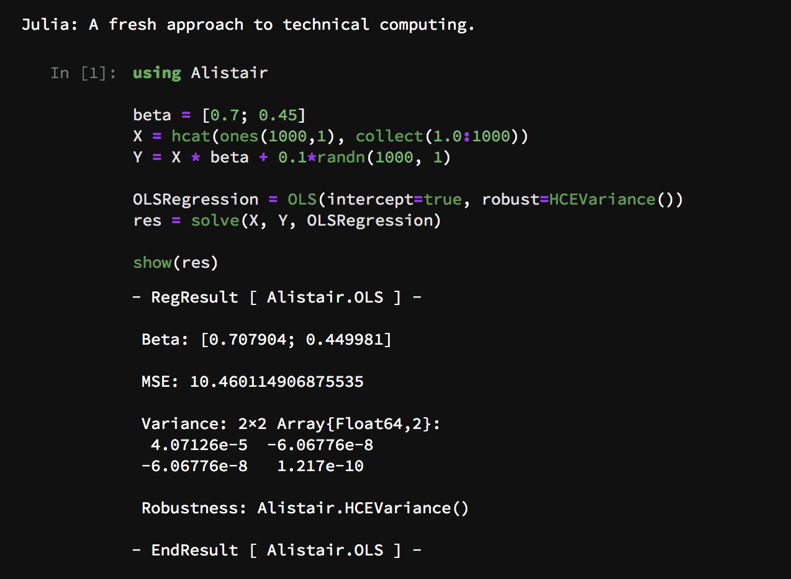

<h1 align="center">
  <br>
  <a href="https://github.com/giob1994/Alistair.jl"></a>
  <br>
  <a>Alistair.jl</a>
  <br>
</h1>

<h3 align="center">A minimal regression library for <a href="http://julialang.org" target="_blank">Julia</a></h3>
<p align="center">
<a href="https://travis-ci.org/giob1994/Alistair.jl">
 
 </a>
 <br>
</p>

<p align="center">
 
</p>

## Why Alistair.jl?

While Julia already has some packages that are fit for regression, like **[GLM.jl](https://github.com/JuliaStats/GLM.jl)**, sometimes a simple, bare-bones regression package is just what is needed. For example, GLM.jl relies on DataFrames as input; also, the syntax is a bit heavy, and relies on high-level constructs.

**Alistair.jl** on the other hand is *minimal*, *intuitive* and *fast*.

Take the folllowing OLS (Ordinary Least Squares) regression as an example:

```julia
beta = [0.7; 0.45]
X = hcat(ones(100,1), collect(1.0:100))
Y = X * beta + 0.1*randn(100, 1)
```

Using **Alistair.jl** we solve this with:

```julia
using Alistair

result = linregress(X, Y, OLS(intercept=true, robust=true))
```

Compare it to the equivalent GLM.jl code:

```julia
using Compat, DataFrames, StatsBase, GLM

data = DataFrame(X1=X[:,2], Y1=Y[:])
OLS_result = glm(@formula(Y1 ~ X1), data, Normal(), IdentityLink())
```
